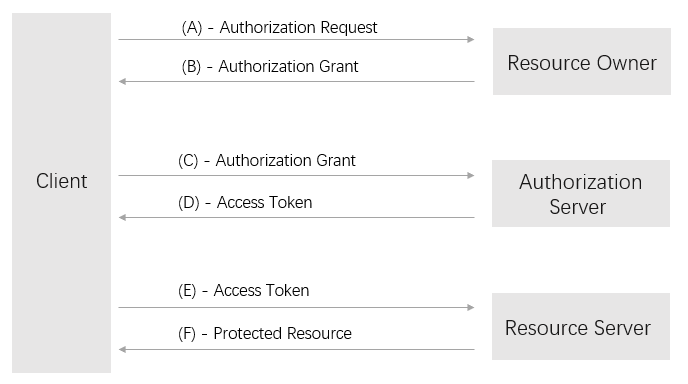

# Auth2.0接口指南

#### OAuth 2.0 介绍
OAuth 2.0 是一个开放授权标准，用于用户授权第三方应用访问该用户在留园网的资源而不需要提供账号密码信息给第三方应用。

#### OAuth 2.0 角色
OAuth 2.0 有以下四个角色：


| 角色                  | 	说明                                              |
| :------------------- | :-------------------------------------------------- |
| Resource Owner       | 	资源拥有者                                         |
| Resource Server      | 	资源服务器                                         |
| Client               | 	第三方应用客户端，指任何可以消费资源服务器的第三方应用 |
| Authorization Server | 	授权服务器，管理上述三个角色的中间层                 |


#### OAuth 2.0 授权流程


A. 客户端请求资源所有者的授权。
B. 资源所有者同意授权。
C. 客户端获得了资源所有者的授权之后，向授权服务器申请授权令牌。
D. 授权服务器验证客户端无误后发放授权令牌。
E. 客户端拿到授权令牌之后请求资源服务器发送用户信息。
F. 资源服务器验证令牌无误后将用户信息发放给客户端。

### 留园网Auth 2.0使用说明

#### 第三方接入：
1. 首先需要对接留园网系统资源的用户，需要向留园网提出申请，在申请的时候，需要准备一个网站地址：**redirect_uri** 该地址用于授权的回调使用。
2. 申请通过后，得到一组 **client_id** 和 **client_secret**，用于后续获取资源访问授权码。

#### 资源地址
| 资源类型      |                   域名                    |                说明                 |
| :------------ | ---------------------------------------- | ----------------------------------- |
| 授权地址      | https://auth.6park.com/index.php?app=authorize | 获取用户授权,获取 Authorization Code |
| Token获取地址 | https://auth.6park.com/index.php?app=token     | 获取资源访问token                    |
| 资源服务器     | https://resource.e2bo.com                | 使用token获取对应的网站资源           |


#### 授权服务
1. 请求方式：
> GET

##### 必传参数
|      参数       |     值     |                        说明                         |
| -------------- | --------- | --------------------------------------------------- |
| response_type= | code      | 请求类型，这里只能写 **code**                         |
| client_id      | 客户ID     | 系统给你派发的 **client_id**                         |
| state          | 任意字符串 | 必填，传递后，原样返回，可以用于防御csrf攻击，所以请携带 |

最终的请求地址是
> 授权服务器地址&response_type=code&client_id=client_id&state=xyz

2.返回：
如果有异常，系统将会返回对应的错误信息，如果无异常的情况下，系统将自动跳转页面到您提交的**redirect_uri**  ，同时以GET的方式，回传code给你，请在redirect_uri对应的回调地址中，获取对应的code信息，为下一步获取token做准备。

#### 获取token
1. 请求
```
POST Token获取地址
Authorization: Basic <Auth>
Content-Type: application/x-www-form-urlencoded
grant_type=authorization_code&code=<code>client_id=<client_id>
```
##### 说明
1.  请求使用 POST 方式提交
2.  grant_type=authorization_code 固定
3.  code为上个接口中，回调的code的值
4.  client_id 为系统分配的client_id
5.  请求的时候，需要携带Authorization认证。

##### Authrization认证的方式
> Authorization: Basic &lt;Auth&gt;
> 其中 &lt;Auth&gt; 为经过 base64 编码的 client_id 和 client_secret，即 base64_encode(client_id:client_secret)

##### 返回结果
```
结果数据类型:JSON
格式：
{
    "access_token": Token
    "expires_in" : 有效期
}

```
如果没有access_token返回，则表示请求错误了，有对应的错误信息展示。
<font color="red">注意：</font>
token仅仅在 expires_in 的时间内有效，过期将无效。

#### 资源请求
请查阅 资源文档

#### 附件
为方便用户调用资源，所以特封装了一个开源的网络请求插件，地址:
> [OAuth2.git](https://github.com/sixpark-source/OAuth2.git)
